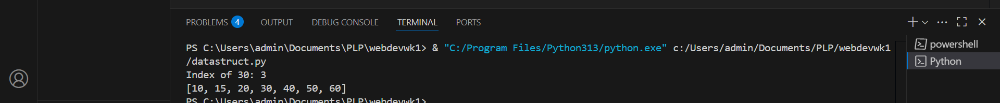

# PLP-Week2Python-List
This repository is part of an assignment submitted to PowerLearnProject as part of an assignment for Python Module.

# List Operations in Python

This repository contains a Python script demonstrating various list operations. It walks through creating a list, modifying its contents, and performing common tasks like appending, inserting, sorting, and finding elements. The script contains step-by-step comments explaining each operation.

---
## Usage

1. Clone the repository:
   git clone https://github.com/aizocraft/PLP-Week2Python-List.git
   cd PLP-Week2Python-List
2.Run the code
  python list_operations.py

3. Output
   It will prints the index of the value 30 in the list
   It also prints the final sorted list

   Index of 30: 3
  Final sorted list: [10, 15, 20, 30, 40, 50, 60]

## Screenshot

Below is an example of the output generated by the script:

---

## Technologies Used

- Python 3

---

## Why Use This Script?

This script is perfect for:

- Beginners learning Python and list operations.
- Developers looking for simple examples of list manipulation.
- Educators seeking examples to teach Python basics.

---

## License

This project is licensed under the Creative Commons License.
